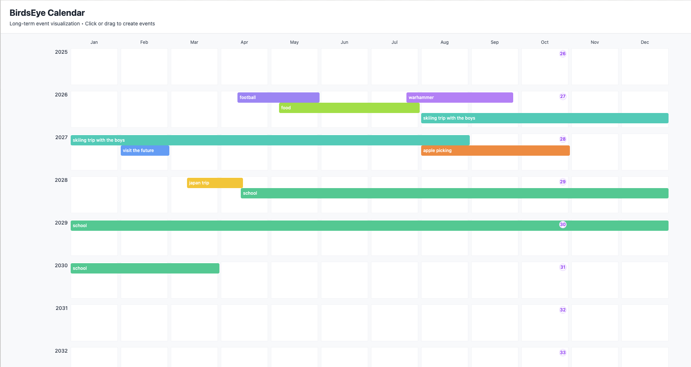

# BirdsEye Calendar

A frontend-only React application for visualizing long-running events across months and years. Events are displayed as horizontal bars on a grid where the x-axis represents weeks/months and the y-axis represents years.

## Tech Stack

- React + Vite + TypeScript
- Tailwind CSS (styling)
- date-fns (date utilities)
- zustand (state management)
- LocalStorage (persistence)