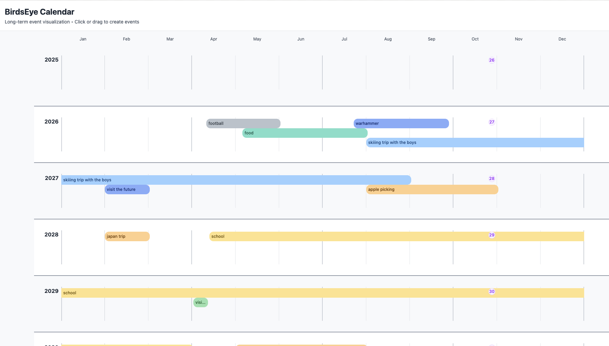

# BirdsEye Calendar

A frontend-only React application for visualizing long-running events across months and years. Events are displayed as horizontal bars on a grid where the x-axis represents months and the y-axis represents years.

## Features

### Core Calendar
- **Grid visualization**: Months (x-axis) by years (y-axis) layout
- **Event creation**: Click or drag across cells to create events
- **Event editing**: Click any event bar to edit its details
- **Event deletion**: Remove events via the event modal
- **Drag in any direction**: Auto-swaps dates if dragging backwards
- **LocalStorage persistence**: All data saved automatically in browser

### Event Management
- **Event name autocomplete**: Suggests existing event names as you type (press Tab to accept)
- **Smart color matching**: Auto-assigns colors based on matching event names
- **Auto date adjustment**: End date maintains duration when start date is changed
- **Color palette**: Beautiful preset color selection for events
- **Rounded event bars**: Modern, polished visual design
- **Enhanced readability**: Optimized text colors based on event bar background

### Multiple Calendars
- **Create multiple calendars**: Organize events into different calendars (e.g., Work, Personal, Family)
- **Switch between calendars**: Dropdown selector to view different calendars
- **Rename calendars**: Inline editing of calendar names
- **Clone calendars**: Duplicate a calendar with all its events
- **Delete calendars**: Remove calendars (deletes all associated events)
- **Import/Export**: Export calendars to JSON files and import them later
- **Improved dropdown UI**: Modern, accessible calendar switcher

### Personal Features
- **Birthday tracking**: Set your birthday in settings
- **Age indicators**: See your age displayed on birth month cells
- **Settings modal**: Manage birthday and calendar preferences

## Tech Stack

- React + Vite + TypeScript
- Tailwind CSS (styling)
- Zustand (state management)
- Lucide React (icons)
- LocalStorage (persistence)